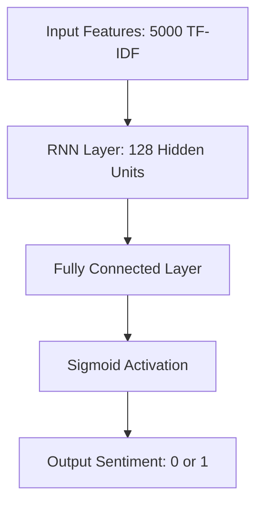
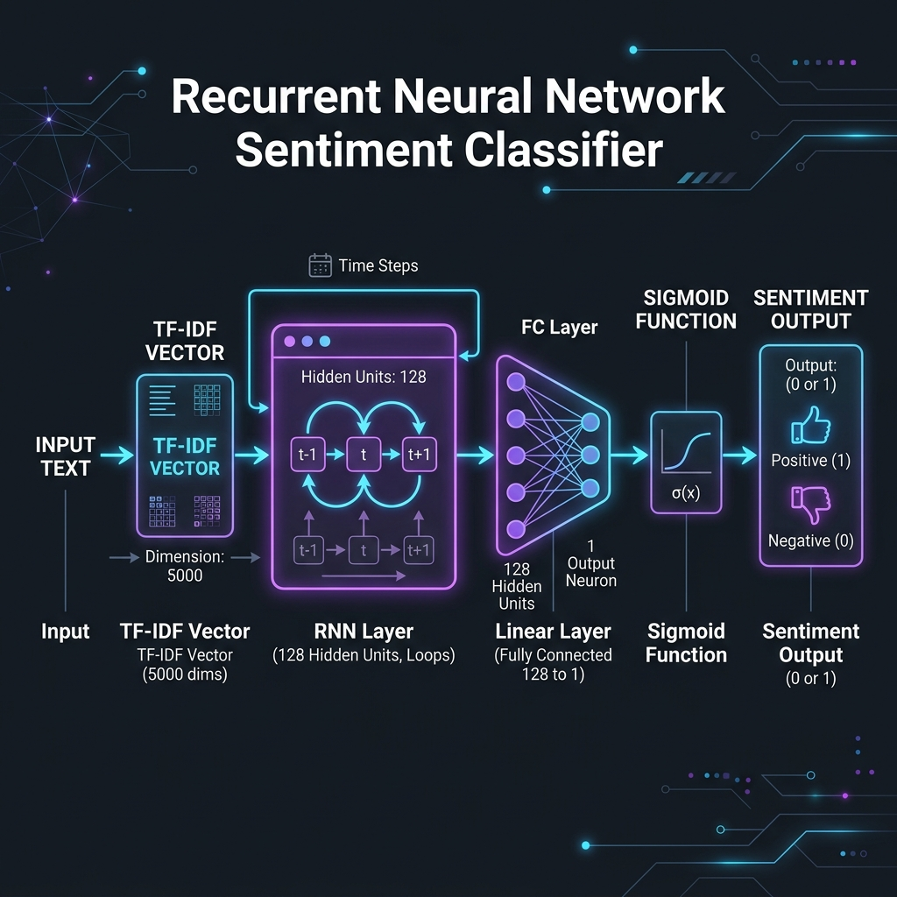

# 🎬 RNN for IMDB Sentiment Analysis

A PyTorch-based Recurrent Neural Network (RNN) designed to classify the sentiment of movie reviews from the IMDB dataset as either **positive** or **negative**. This project demonstrates the end-to-end pipeline of NLP preprocessing, text vectorization (TF-IDF), dataset curation using PyTorch `TensorDataset`, and training a custom Recurrent Neural Network.

---

## 📊 Dataset Overview

The project uses the **IMDB Dataset of 50K Movie Reviews** for sentiment analysis.

- **Features**: `review` (textual review of the movie)
- **Target**: `sentiment` (labeled as `positive` or `negative`)
- **Size**: ~50,000 highly polar movie reviews for training and testing.

> ⚠️ **Note**: The dataset (`IMDB Dataset.csv`) is excluded from this repository via `.gitignore` due to file size constraints.

---

## 🛠️ Natural Language Processing Pipeline

Before feeding text into the RNN model, the reviews go through a rigorous preprocessing pipeline:

1. **Lowercasing**: Standardizing all review text to lowercase.
2. **Cleaning**: Removing HTML tags, URLs (http/https), and punctuation marks using Regex.
3. **Stopword Removal**: Eliminating non-informative words using the NLTK library.
4. **Stemming**: Reducing words to their base form using the `PorterStemmer`.
5. **Encoding**: Encoding categorical labels (`positive` -> `1`, `negative` -> `0`).
6. **Vectorization**: Transforming the text corpus into numerical vectors using a TF-IDF Vectorizer (top 5,000 features).

---

## 🧠 Model Architecture

The custom RNN classifier is implemented in PyTorch and structured as follows:

## 🧠 Model Architecture

